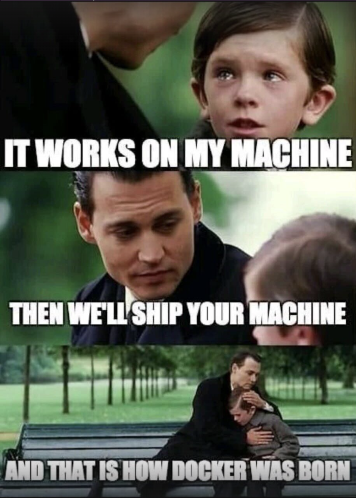

# Docker

---

Most computers are set up differently. These differences can cause your code to 
possibly run differently on various machines.



---

## Basics

[Install Docker](https://docs.docker.com/desktop/install/mac-install/)

I signed in through GitHub and was not redirected back to the app.
This is a known [issue](https://github.com/docker/for-mac/issues/7160).
By clicking `skip` I was able to see I was logged in; it just didn't refresh.

To learn through the app, click the Grad hat to get to the learning center.

### Container

A container is a specific environment that you can set up.

Click on `Port(s)` to see the app running in the browser.

#### How do I run a container?

Create a `DockerFile` (No dot extension!)

Example `DockerFile`
```dockerfile
# Start your image with a node base image
FROM node:18-alpine

# The /app directory should act as the main application directory
WORKDIR /app

# Copy the app package and package-lock.json file
COPY package*.json ./

# Copy local directories to the current local directory of our docker image (/app)
COPY ./src ./src
COPY ./public ./public

# Install node packages, install serve, build the app, and remove dependencies at the end
RUN npm install \
    && npm install -g serve \
    && npm run build \
    && rm -fr node_modules

EXPOSE 3000

# Start the app using serve command
CMD [ "serve", "-s", "build" ]
```

Images are used to run containers, to build an image run:
```shell
docker build -t your-tag-name .
```
The -t flag tags your image with a name the `.` lets Docker know where it can find the Dockerfile.

Once the build is complete, an image will appear in the Images tab. 
Select the image name to see its details. Select Run to run it as a container. 
In the Optional settings remember to specify a port number (something like 8089).

### Image: What is it?
Here’s why Docker calls it an "image":

- Snapshot Concept: Like a photograph captures a snapshot of a moment in time, 
- a Docker image captures the state of a software environment at a specific point, 
- including all dependencies, configurations, libraries, and the application code itself.

- Template for Containers: A Docker image is a template or blueprint used to create 
- containers. Just as a photo can be printed multiple times from a digital file, a Docker image can be 
- instantiated into multiple running containers without modifying the original "image" file.

### Running other people's images

Use `cmd + K` to search for other docker images then select `Run`

### Multi-container applications

Instead of clicking `Run` individually, can use `Docker Compose`.

Make a compose file to tell Docker how to run your application.
`compose.yaml`
```yaml
services:
  todo-app:
    build:
      context: ./app
    depends_on:
      - todo-database
    environment:
      NODE_ENV: production
    ports:
      - 3000:3000
      - 35729:35729
    develop:
      watch:
        - path: ./app/package.json
          action: rebuild
        - path: ./app
          target: /usr/src/app
          action: sync

  todo-database:
    image: mongo:6
    #volumes: 
    #  - database:/data/db
    ports:
      - 27017:27017

#volumes:
  #database:
```
Comments are provided throughout this file to help you get started.
If you need more help, visit the Docker compose [reference guide](https://docs.docker.com/compose/compose-file/).

Here the instructions define your application as two services called "todo-app" and “todo-database”
The service “todo-app” is built from the `Dockerfile` in the /app directory,
and the service “todo-database” uses the official MongoDB image
from Docker Hub - https://hub.docker.com/_/mongo.
You can add other services your application may depend on here.

Build and run all services listed in the `compose.yaml` file:
```shell
docker compose up -d
```
> The -d flag tells docker compose to run in detached mode.

To view, click on your multi-container and the port link.

#### Hot reload / Watch
```shell
docker compose watch
```
Running either of these commands will create the multi-container in the Docker Desktop app.
You may delete the container inside the desktop app to restart, deleting the
database container along with it. **All data will be lost.**

### Volumes: Persisted data

Don't wanna lose all your data?
Docker isolates all content, code, and data in a container from your local filesystem.
This means that Docker is _separate_ from your filesystem!
To allow Docker to manage files from your local filesystem, we need a volume.

Uncomment the lines above:
```yaml
todo-database:
    # ...
    volumes:
      - database:/data/db
                      
# ...
volumes:
  database:
```
The volumes element that is nested in todo-database tells Compose to mount the volume 
named database to /data/db in the container for the todo-database service.

The top-level volumes element defines and configures a volume named database 
that can be used by any of the services in the Compose file.

Delete and restart:
Now, no matter how often you delete and restart the container, your data is persisted 
and accessible to any container on your system by mounting the database volume. 
Docker will check for a volume and create one if there is none present.

### Access your local folder from a container

Sometimes you may want the container to access a directory on your system. 
This is when you use bind mounts.

#### Bind Mounts
A bind mount lets you share a directory from your host's filesystem into the container.

`compose.yaml`
```yaml
todo-app:
    # ...
    volumes:
      - ./app:/usr/src/app
      - /usr/src/app/node_modules
```
Explanation:
The volumes element tells Compose to mount the local folder `./app to /usr/src/app`
in the container for the todo-app service. 
This particular bind mount overwrites the static contents of the `/usr/src/app` 
directory in the container and creates what is known as a development container. 
The second instruction, `/usr/src/app/node_modules`, prevents the bind mount 
from overwriting the container's node_modules directory to preserve the packages 
installed in the container.

Your local system is reflected in the container. This allows the same functionality
as hot reload / watch did, edit the HTML in your editor to see.

### Docker init
Create a `Dockerfile` to define your image and a `compose.yaml` file to define how to run it.

- [Compose Docs](https://docs.docker.com/reference/compose-file/)
- [Dockerfile Docs](https://docs.docker.com/reference/dockerfile/)

